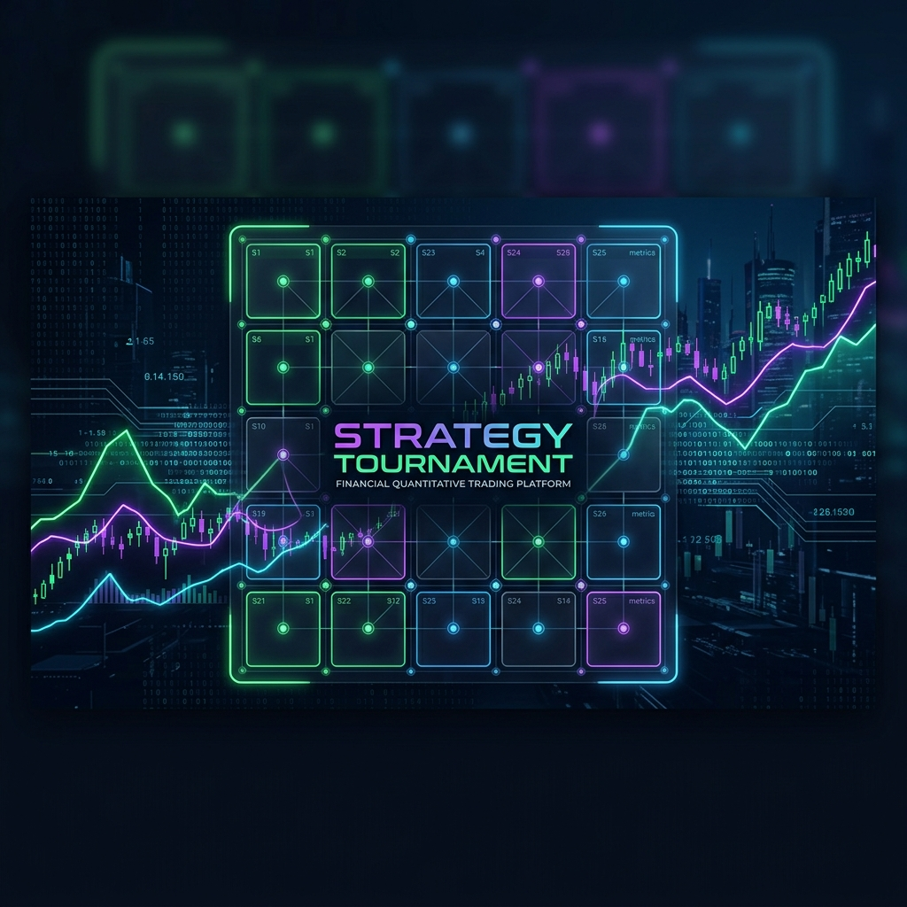

# 📈 Strategy Tournament: Dynamic Leverage & Quant Console

<div align="center">
  
  <br>
  
  [](https://tenkdotolami.github.io/Strategy-Tournament/)
  [](https://github.com/TenKdoToLami/Strategy-Tournament)
  [](LICENSE)
</div>

---

## 🏛️ Project Vision
**Strategy Tournament** is a professional-grade quantitative simulation environment designed to stress-test **dynamic drawdown-based leveraging strategies**. Unlike static backtests, this platform utilizes a state-machine architecture to transition between market regimes, optimizing capital efficiency while strictly managing downside risk.

> "Leverage should not be a static choice, but a dynamic reward earned by the market's stability."

---

## 🚀 Key Modules

### 1. 📊 Performance Dashboard
The "Tournament" view compares 20+ precomputed institutional strategies against S&P 500 benchmarks.
- **Advanced Metrics**: Calmar, Sortino, Jensen's Alpha, and Omega Ratios.
- **Dual Visuals**: Linear and Logarithmic growth curves.
- **Real Returns**: Inflation-adjusted performance using FRED CPI-U data.

### 2. 🧪 Quant Lab (Strategy Builder)
An interactive "Strategy Laboratory" for real-time browser-side simulation.
- **Allocation Matrix**: Define custom asset weights across 5 drawdown tiers (T0-T4).
- **Logic Selection**: Toggle between **Daily Rebalancing** and **Ratchet Logic**.
- **Regime Filters**: Configure 200-day SMA/EMA trend shields.

### 3. 🕹️ Logic Simulator
A high-fidelity visualization of the strategy state-machine.
- **Drawdown Slider**: Adjust current market conditions to see logic transitions in real-time.
- **Decision Engine**: Visualize path-dependent "Ratchet" vs "Linear" logic.

### 4. 🧭 Strategy Explorer
Side-by-side comparison tool for deep-diving into specific strategy mechanisms, trend-filter interactions, and calendar year performance.

---

## 📐 Quantitative Methodology

### The Standard Epoch (2002+)
To ensure 100% mathematical integrity, all simulations begin on **July 1st, 2002**. This aligns with the inception of the **PCRIX (Commodity Proxy)**, eliminating the statistical "interpolation error" often found in longer-duration backtests that lack commodity data.

### Synthetic Asset Synthesis
Since high-leverage (4x) ETFs are rare or suffer from extreme fees, our engine synthesizes their returns using a **Cost of Carry** model:

$$R_{lev} = (R_{und} \times L) - (R_{fin} \times (L - 1))$$

- **$R_{und}$**: VOO (1x) Daily Return.
- **$L$**: Leverage Factor (2.0x, 4.0x).
- **$R_{fin}$**: Financing Rate (Proxied by VFISX/BILL).

### The Hysteresis Engine (Ratchet Logic)
Under **Ratchet Logic**, state transitions are "sticky" during recovery. A portfolio that hits T4 (Major Crash) remains at maximum tilt until a **New All-Time High** is reached, ensuring the strategy captures the full velocity of the recovery rally.

---

## 🏆 The Strategy "Hall of Fame"
Results from a **500,000-iteration** global optimization at 5% resolution.

| Strategy | Performance Goal | Highlight |
|:---------|:-----------------|:----------|
| **Special BEAST** | Maximum Growth | **20.03% CAGR** using Ratchet Logic. |
| **Special SCALPEL** | Equity Replacement | Beats VOO CAGR with **-23.6% Max Drawdown**. |

---

## 🛠️ Local Development & Pipeline

### 1. Requirements
- Python 3.10+
- Pandas, YFinance, Scipy (see `requirements.txt`)

### 2. Setup
```bash
# Clone the repository
git clone https://github.com/TenKdoToLami/Strategy-Tournament.git

# Install dependencies
pip install -r requirements.txt

# Run the precompute pipeline (Updates data/data.json)
python scripts/precompute.py

# Launch the locally
python -m http.server 8000
```

### 3. Data Flow
1. **Fetch**: Github Actions triggers `scripts/precompute.py`.
2. **Compute**: Pandas calculates signals, synthetic assets, and precomputes "Hall of Fame" variants.
3. **Serve**: `data/data.json` is exported for the frontend JS engine.

---

## 📜 Technical Documentation
For a deeper dive into "Volatility Drag", "Regime Detection", and "Ladder Philosophy", visit the **Master Manual** located directly inside the [Live Dashboard Documentation Tab](https://tenkdotolami.github.io/Strategy-Tournament/).

---

## ⚖️ License & Disclaimer
This project is for **educational and research purposes only**. Leverage carries extreme risk of loss. 
**MIT License** | Developed by [TenKdoToLami](https://github.com/TenKdoToLami)
